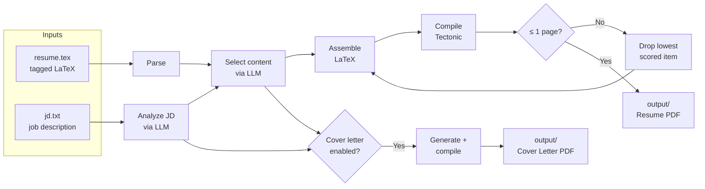

# AutoCustomizeResume

Auto-customize a tagged LaTeX resume (and optional cover letter) for each job description using LLM-powered content selection, compiled to PDF with Tectonic.

[](./LICENSE)
[](./pyproject.toml)
[](https://github.com/avishj/AutoCustomizeResume/stargazers)
[](https://github.com/avishj/AutoCustomizeResume/commits/main)

## How it works

You tag your LaTeX resume with `pinned` (always keep) and `optional` (LLM decides) markers. Paste a job description, and the tool selects the most relevant content, reorders skills, and compiles a one-page PDF. If the result exceeds one page, it automatically drops the lowest-scored optional items and recompiles.



Both output files are also archived to `history/` with timestamps so previous runs are never overwritten.

## Prerequisites

- **Python 3.10+**
- **[uv](https://docs.astral.sh/uv/)** (recommended)
- **[Tectonic](https://tectonic-typesetting.github.io)** on PATH
  - macOS: `brew install tectonic`
  - Linux: [install guide](https://tectonic-typesetting.github.io/en-US/install.html)
  - Cargo: `cargo install tectonic`
- **LLM API key** for any OpenAI-compatible provider (or local Ollama)

## Quick start

```bash
git clone https://github.com/avishj/AutoCustomizeResume.git
cd AutoCustomizeResume

# Install
uv sync

# Copy example config, env, and resume template
cp examples/config.example.yaml config.yaml
cp examples/.env.example .env
cp examples/resume.simple.example.tex resume.tex
# OR for a full-featured template:
# cp examples/resume.advanced.example.tex resume.tex

# Fill in config.yaml with your details and add your API key to .env

# Paste a job description
pbpaste > jd.txt   # or copy/create manually

# Run
uv run autocustomizeresume --jd jd.txt
```

Output lands in `output/`. See [`examples/`](./examples/) for all sample files and setup notes.

## Tagging your resume

You mark sections, items, and bullets with LaTeX comment tags so the tool knows what it can include or exclude.

```latex
%%% BEGIN:pinned:education        ← always included
\section{Education}
    %%% BEGIN:optional:state-u     ← LLM decides per job
    \resumeSubheading{State University}{...}
    %%% END:optional:state-u
%%% END:pinned:education

%%% SKILLS:languages               ← LLM can reorder, add, remove
\textbf{Languages}{: Python, Go, Rust, SQL}
%%% END:SKILLS:languages
```

Full specification: [docs/TAGS.md](./docs/TAGS.md)

## Configuration

Start from [`examples/config.example.yaml`](./examples/config.example.yaml) and copy it to `config.yaml`.

| Section | Key | Description |
|---------|-----|-------------|
| `user` | `first_name`, `last_name` | Used for output file naming and cover letter header |
| `user` | `phone`, `email`, `linkedin`, `website`, `degree`, `university` | Cover letter header fields |
| `naming` | `output_resume`, `output_cover` | Naming templates for `output/` (overwritten each run) |
| `naming` | `history_resume`, `history_cover` | Naming templates for `history/` (timestamped archive) |
| `llm` | `base_url`, `model` | LLM endpoint and model name |
| `llm` | `api_key_env` | Name of the environment variable holding your API key |
| `cover_letter` | `enabled` | `true` or `false` |
| `cover_letter` | `template`, `style`, `signature_path` | Template path, style prompt, optional signature image |
| `paths` | `master_resume`, `jd_file` | Input file paths |
| `paths` | `output_dir`, `history_dir` | Output directories |
| `watcher` | `debounce_seconds` | Seconds to wait after last file change before triggering |

**Naming template variables:** `{first}`, `{last}`, `{company}`, `{role}`, `{date}`, `{timestamp}`

## Usage

### One-shot mode

Process a single job description and exit.

```bash
uv run autocustomizeresume --jd path/to/jd.txt
```

### Watch mode (default)

Monitors `jd.txt` (configurable via `paths.jd_file`) and rebuilds on every save.

```bash
uv run autocustomizeresume
```

Press `Ctrl+C` to stop.

### CLI flags

| Flag | Description |
|------|-------------|
| `--jd PATH` | Path to JD file (triggers one-shot mode) |
| `--company NAME` | Override LLM-extracted company name |
| `--role TITLE` | Override LLM-extracted role title |

```bash
uv run autocustomizeresume --jd jd.txt --company "Acme Corp" --role "Backend Engineer"
```

## Supported LLM providers

Any OpenAI-compatible API works. Set `llm.base_url` and `llm.model` in `config.yaml`, and put the API key in `.env`.

| Provider | `base_url` | Notes |
|----------|-----------|-------|
| NVIDIA NIM | `https://integrate.api.nvidia.com/v1` | Free tier available |
| OpenAI | `https://api.openai.com/v1` | |
| Groq | `https://api.groq.com/openai/v1` | Fast inference |
| Together | `https://api.together.xyz/v1` | |
| Ollama | `http://localhost:11434/v1` | Local, no API key needed |

## Troubleshooting

**"tectonic is not installed or not on PATH"**
Install Tectonic and make sure it is accessible from your terminal. See [Prerequisites](#prerequisites).

**"API key not found"**
Set the environment variable named by `llm.api_key_env` (default: `LLM_API_KEY`) in your `.env` file or shell.

**"Config file not found"**
Copy `examples/config.example.yaml` to `config.yaml` in the project root.

**Resume exceeds one page after all retries**
The tool auto-drops lowest-scored optional items, but if your pinned content alone exceeds one page, reduce content or adjust template spacing. You can also convert some `pinned` tags to `optional` to give the tool more flexibility.

**Watch mode not triggering**
Check that you are editing the file at `paths.jd_file` (default: `jd.txt`). The watcher debounces changes by `watcher.debounce_seconds` before running.

## License

[GNU Affero General Public License v3.0 (AGPL-3.0)](./LICENSE)

## Star History

[](https://star-history.com/#avishj/AutoCustomizeResume&Date)
